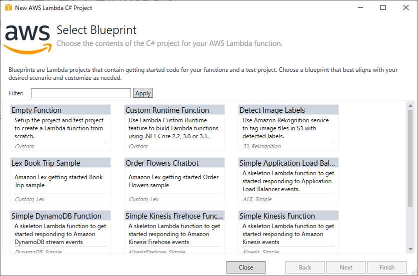

# AWS Lambda

using .NET Core 3.1;

## Official
- [aws/aws-lambda-dotnet: Libraries, samples and tools to help .NET Core developers develop AWS Lambda functions.](https://github.com/aws/aws-lambda-dotnet)
- [AWS Lambda が .NET Core 3.1 のサポートを開始](https://aws.amazon.com/jp/about-aws/whats-new/2020/03/aws-lambda-now-supports-net-core-3-1/)
  - [Announcing AWS Lambda support for .NET Core 3.1 | AWS Compute Blog](https://aws.amazon.com/jp/blogs/compute/announcing-aws-lambda-supports-for-net-core-3-1/)
- [Building Lambda Functions with C# - AWS Lambda](https://docs.aws.amazon.com/lambda/latest/dg/lambda-csharp.html)

## Document
- Working with C#
  - Deployment Package
    - .NET Core CLI
    - [AWS Toolkit for Visual Studio](#aws-toolkit-for-visual-studio)
  - Handler
  - Context
  - Logging
  - Errors

### [AWS Toolkit for Visual Studio](https://docs.aws.amazon.com/lambda/latest/dg/csharp-package-toolkit.html)
You can build .NET-based Lambda applications using the Lambda plugin to the AWS Toolkit for Visual Studio. The toolkit is available as a Visual Studio extension.

1. Microsoft Visual Studio を起動して **新しいプロジェクト** を選択します。  
  a. **ファイル** メニューから **新規作成** を選択して **プロジェクト** を選択します。  
  b. **新しいプロジェクトの作成** ウィンドウで **AWS Lambda Project (.NET Core)** を選択して **次へ** を選択します。  
  c. **Select Blueprint** ウィンドウで you will be presented with the option of selecting from a list of sample applications that will provide you with sample code to get started with creating a .NET-based Lambda application.  
  d. スクラッチで Lambda アプリケーションを作成する場合は **Empty Function** を選択して **Finish** を選択します。  
  
2. プロジェクトの一部として作成された `aws-lambda-tools-defaults.json` ファイルを確認してください。このファイル内にオプションを設定することができます。デフォルトで Lambda tooling に読み込まれます。 Visual Studio によって作成されるプロジェクトテンプレートはこれらの多くのフィールドをデフォルト値で設定します。 Note the following fields:
  * **profile** - The name of a profile in your [AWS SDK for .NET credentials file](https://docs.aws.amazon.com/sdk-for-net/latest/developer-guide/net-dg-config-creds.html).
  * **function-handler** - This is where the `function handler` is specified, which is why you don't have to set it in the wizard. However, whenever you rename the *`Assembly`, `Namespace`, `Class` or `Function`* in your function code, you will need to update the corresponding fields in the `aws-lambda-tools-defaults.json file`.
  ```json
  {
    "profile":"default",
    "region" : "us-east-2",
    "configuration" : "Release",
    "framework" : "netcoreapp2.1",
    "function-runtime":"dotnetcore3.1",
    "function-memory-size" : 256,
    "function-timeout" : 30,
    "function-handler" : "Assembly::Namespace.Class::Function" 
  }
  ```
3. **Function.cs** ファイルを開いてください。 Lambda function hander のコードを実装するテンプレートが提供されます。  
```cs
using System;
using System.Collections.Generic;
using System.Linq;
using System.Threading.Tasks;

using Amazon.Lambda.Core;

// Assembly attribute to enable the Lambda function's JSON input to be converted into a .NET class.
[assembly: LambdaSerializer(typeof(Amazon.Lambda.Serialization.SystemTextJson.LambdaJsonSerializer))]

namespace AWSLambda2
{
    public class Function
    {
        
        /// <summary>
        /// A simple function that takes a string and does a ToUpper
        /// </summary>
        /// <param name="input"></param>
        /// <param name="context"></param>
        /// <returns></returns>
        public string FunctionHandler(string input, ILambdaContext context)
        {
            return input?.ToUpper();
        }
    }
}
```
4. Lambda function のコードを書いたら、アプリケーションの **プロジェクト** ノードを右クリックして **Publish to AWS Lambda** を選択することでアップロードすることができます。
